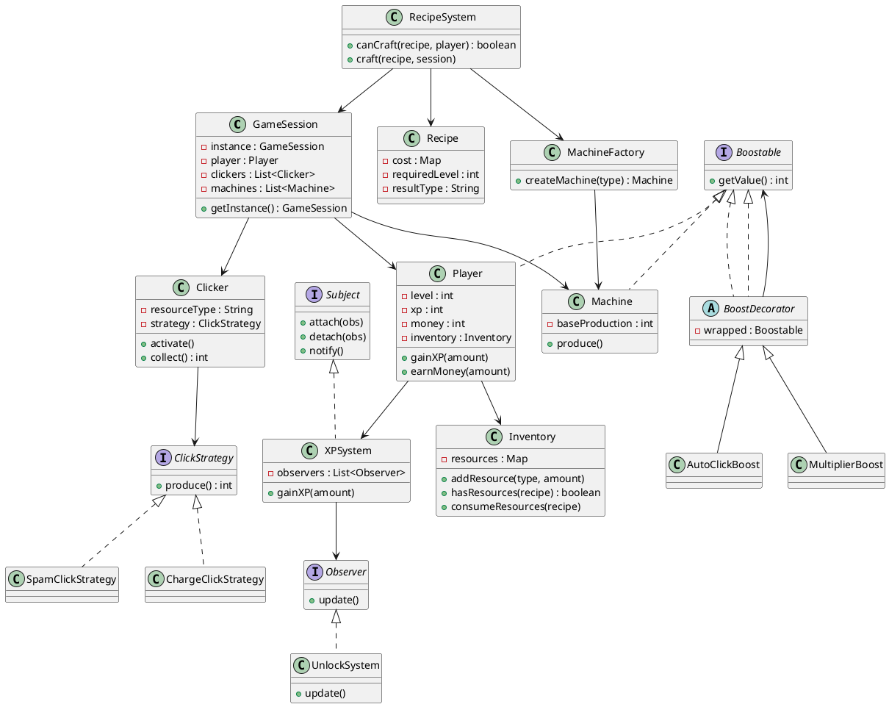

# Conception technique

> Ce document décrit l'architecture technique de votre projet. Vous êtes dans le rôle du lead-dev / architecte. C'est un document technique destiné à des développeurs.

## Vue d'ensemble

<!-- Décrivez les grandes briques de votre application et comment elles communiquent. Un schéma d'architecture est bienvenu. -->

## Design Patterns

### DP 1 — *Singleton*

**Feature associée** : gestion de l'inventaire des ressources et de l'etat du jeu

**Justification** : Cela permet de garantir que tous les composants de l'application accèdent à la même instance d'inventaire. Et évite donc les problèmes de synchronisation et de cohérence des données qui pourraient survenir si plusieurs instances existaient. De plus, cela simplifie l'accès à l'inventaire depuis n'importe quelle partie du code sans avoir à passer des références d'instance partout.
De plus ça nous permettrai de voir ou en est le jeu en temps réel et de faire des sauvegardes régulières de l'état du jeu pour éviter les pertes de progression en cas de plantage ou de fermeture accidentelle. Quand le joueur quitte le jeu, l'état de l'inventaire peut être sauvegardé automatiquement, et lorsqu'il revient, il peut reprendre là où il s'était arrêté. Cela améliore considérablement l'expérience utilisateur en offrant une continuité dans le jeu.
Cela gererait le calcul de l'idle du jeu, en calculant les ressources gagnées pendant l'absence du joueur et en les ajoutant à l'inventaire à son retour. Cela permettrait au joueur de progresser même lorsqu'il n'est pas actif, ce qui est une caractéristique clé des jeux de type clicker.


<!-- Pourquoi ce pattern ? Pourquoi pas un autre ? -->

**Intégration** :  `InventoryService` annotée avec `@Singleton` (Guice). Tous les composants qui ont besoin d'accéder à l'inventaire déclarent une dépendance à `InventoryService` dans leur constructeur, et reçoivent la même instance
<!-- Comment s'intègre-t-il dans l'architecture ? -->
`getInstance()` est utilisé pour accéder à l'instance unique de la session de jeu et de l'inventaire. 
Avec les methodes `updateState()` `saveState()` et `loadState()`, l'état de l'inventaire peut être sauvegardé et restauré, assurant ainsi la continuité du jeu pour le joueur.

### DP 2 — *Strategy*

**Feature associée** : Les differents clicks 

**Justification** : Le click est la fonctionnalité centrale du jeu, et on veut pouvoir changer la façon dont les ressources sont gagnées (par exemple, un load click qui rapporte + mais on doit cliquer au bon moments  et un spamclick qui rapporte moins mais on peut cliquer autant qu'on veut) sans modifier le code de base du click. Le pattern Strategy permet d'encapsuler chaque algorithme de gain de ressources dans une classe séparée et de les interchanger à l'exécution. 

**Intégration** : spamclick et loadclick implémentent une interface `ClickStrategy`. 

### DP 3 — *Observer*

**Feature associée** : gerer la la mise a jour du son, image

**Justification** : Quand le joueur clique (Fonctionnalité 1), le ResourceManager doit mettre à jour les ressources, le SoundManager doit jouer un son de clic, et le UIManager doit mettre à jour l'affichage des ressources. En utilisant le pattern Observer, chaque manager peut s'abonner aux événements de clic sans que le ResourceManager ait besoin de connaître les détails de qui écoute. Cela découple les composants et rend le code plus modulaire et maintenable. L'alternative (un `switch/case` centralisé) serait moins flexible et violerait le principe Single Responsibility.

**Intégration** : une interface `ClickObserver` avec une méthode `onClick()`. Les managers (ResourceManager, SoundManager) implémentent cette interface et s'enregistrent auprès du `ClickService` via `addClickObserver(...)`. Le `ClickService` notifie tous les observers à chaque clic.

### DP 4 — *Decorator*

**Feature associée** : gerer les bonus temporaires

**Justification** : Quand le joueur active un bonus temporaire (par exemple, double click pendant 30 secondes), on veut pouvoir ajouter cet effet à l'expérience de jeu sans modifier la classe `Player` ou les autres classes de base. Le pattern Decorator permet d'envelopper un objet existant (le joueur) avec une nouvelle fonctionnalité (le bonus) de manière transparente. Cela respecte le principe Open/Closed et facilite l'ajout de nouveaux types de bonus à l'avenir.

**Intégration** : une classe `Player` qui représente le joueur de base, et des classes décoratrices comme `DoubleClickPlayer` qui étendent `Player` et ajoutent des fonctionnalités supplémentaires. Lorsqu'un bonus est activé, le service de gestion des bonus crée une instance du décorateur approprié et l'utilise à la place du joueur de base pendant la durée du bonus.

### DP 5 — *Factory*

**Feature associée** : gerer la création de nouvelles machines 

**Justification** : Quand le joueur débloque une nouvelle machine, on veut pouvoir créer une instance de cette machine sans exposer la logique de construction dans le code client. Le pattern Factory centralise la création des machines et garantit que les objets sont créés de manière cohérente. Cela facilite également l'ajout de nouvelles machines à l'avenir sans modifier le code client.
**Intégration** : une classe `MachineFactory` avec des méthodes comme `createWoodCutter()`, `createMine()`, etc., qui retournent des instances de machines préconfigurées. Le service de gestion des machines utilise cette factory pour créer de nouvelles machines lorsque le joueur les débloque, au lieu d'appeler directement les constructeurs.

## Diagrammes UML

### Diagramme 1 — *Diagramme de classe*



### Diagramme 2 — *Type*

```plantuml
@startuml

@enduml
```

