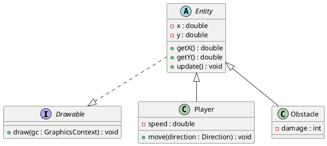

# Conception technique

> Ce document décrit l'architecture technique de votre projet. Vous êtes dans le rôle du lead-dev / architecte. C'est un document technique destiné à des développeurs.

## Vue d'ensemble

<!-- Décrivez les grandes briques de votre application et comment elles communiquent. Un schéma d'architecture est bienvenu. -->

## Design Patterns

### DP 1 — *Singleton*

**Feature associée** : gestion de l'inventaire des ressources et de l'etat du jeu

**Justification** : Cela permet de garantir que tous les composants de l'application accèdent à la même instance d'inventaire. Et évite donc les problèmes de synchronisation et de cohérence des données qui pourraient survenir si plusieurs instances existaient. De plus, cela simplifie l'accès à l'inventaire depuis n'importe quelle partie du code sans avoir à passer des références d'instance partout.
De plus ça nous permettrai de voir ou en est le jeu en temps réel et de faire des sauvegardes régulières de l'état du jeu pour éviter les pertes de progression en cas de plantage ou de fermeture accidentelle. Quand le joueur quitte le jeu, l'état de l'inventaire peut être sauvegardé automatiquement, et lorsqu'il revient, il peut reprendre là où il s'était arrêté. Cela améliore considérablement l'expérience utilisateur en offrant une continuité dans le jeu.
Cela gererait le calcul de l'idle du jeu, en calculant les ressources gagnées pendant l'absence du joueur et en les ajoutant à l'inventaire à son retour. Cela permettrait au joueur de progresser même lorsqu'il n'est pas actif, ce qui est une caractéristique clé des jeux de type clicker.


<!-- Pourquoi ce pattern ? Pourquoi pas un autre ? -->

**Intégration** :  `InventoryService` annotée avec `@Singleton` (Guice). Tous les composants qui ont besoin d'accéder à l'inventaire déclarent une dépendance à `InventoryService` dans leur constructeur, et reçoivent la même instance
<!-- Comment s'intègre-t-il dans l'architecture ? -->
`getInstance()` est utilisé pour accéder à l'instance unique de la session de jeu et de l'inventaire. 
Avec les methodes `updateState()` `saveState()` et `loadState()`, l'état de l'inventaire peut être sauvegardé et restauré, assurant ainsi la continuité du jeu pour le joueur.

### DP 2 — *Strategy*

**Feature associée** : Les fonctionnalites ameliorations 

**Justification** : Cela permet de définir une famille d'algorithmes (les différentes améliorations), de les encapsuler dans des classes séparées et de les rendre interchangeables. Le pattern Strategy permet de changer dynamiquement le comportement d'une amélioration sans modifier le code qui l'utilise, ce qui respecte le principe Open/Closed. De plus, cela facilite l'ajout de nouvelles améliorations à l'avenir sans impacter les fonctionnalités existantes.


**Intégration** : une interface `ImprovementStrategy` avec une méthode `applyImprovement(Player player)`. Chaque amélioration (par exemple, `DoubleClickImprovement`, `AutoClickImprovement`) implémente cette interface. Le service de gestion des améliorations utilise ces stratégies pour appliquer les effets correspondants au joueur lorsqu'une amélioration est activée.

### DP 3 — *Nom du pattern*

**Feature associée** : 

**Justification** : 

**Intégration** : 

### DP 4 — *Nom du pattern*

**Feature associée** : 

**Justification** : 

**Intégration** : 

## Diagrammes UML

### Diagramme 1 — *Type (classe, séquence, cas d'utilisation…)*

<!-- Exemple de syntaxe PlantUML (à remplacer par votre diagramme) :



Ceci est un exemple, remplacez-le par votre propre diagramme. -->

```plantuml
@startuml

@enduml
```

### Diagramme 2 — *Type*

```plantuml
@startuml

@enduml
```

