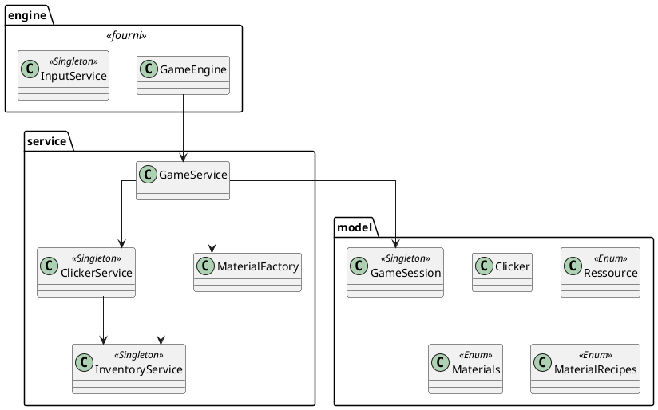

# Document de réversibilité technique

> Ce document est destiné à l'équipe qui reprendra la maintenance du projet. Soyez honnêtes et exhaustifs. Pas d'enjolivement.

## Architecture actuelle
Le projet suit une architecture en 3 couches : Engine (socle technique fourni) → Service (logique métier et gestion de la vue) → Model (données et entités). 
L'injection de dépendances est centralisée via Google Guice.

### Flux d'exécution :
* **App.java** crée l'injecteur Guice via `AppModule` et initialise la fenêtre JavaFX (800x600).
* **GameEngine.start()** appelle `GameService.init()` pour afficher la vue initiale, puis lance la boucle `AnimationTimer` (~60 fps) qui appelle `update()`.
* **GameService** gère les transitions entre la vue principale (récolte) et l'atelier de craft.
* **ClickerService** intercepte les clics sur les objets, calcule les gains selon la stratégie du clicker et met à jour l'**InventoryService**.

## Bugs connus

| Bug | Sévérité | Conditions de reproduction |
| :--- | :---: | :--- |
| **La mise à jour de l'inventaire dans la vue recette est manuelle** | Mineure | Après un craft réussi, l'affichage de l'inventaire dans le titre ou les cartes doit être rafraîchi explicitement. |
| **Le multiplicateur de gain n'est pas borné** | Mineure | Dans certaines stratégies (Spam), cliquer trop vite peut augmenter les gains de façon exponentielle. |
| **Exception ignorée lors du craft** | Mineure | Si les ressources sont insuffisantes, l'exception est "catch" et ignorée (`ignored`), ce qui n'informe pas l'utilisateur. |

## Limitations techniques

* **Absence d'interfaces pour les services** : Actuellement, `GameService`, `ClickerService` et `InventoryService` sont des classes concrètes injectées directement.
* **Mélange Vue/Logique dans GameService** : `GameService` contient à la fois la logique de navigation et la construction détaillée des éléments UI (CSS inline, positions absolues).
* **Système de craft statique** : Les recettes sont basées sur une Enum (`MaterialRecipes`). Ajouter une recette nécessite de modifier le code source et de recompiler.
* **Pas de persistance** : La progression du joueur (inventaire, session) est stockée uniquement en mémoire vive ; tout est perdu à la fermeture.

## Points de vigilance pour la reprise

* **Fichiers protégés** : Ne pas modifier `App.java`, `GameEngine.java` et `InputService.java`. Toute la logique métier doit résider dans les services ou le package `model`.
* **Gestion des Singletons** : `ClickerService` et `InventoryService` sont marqués `@Singleton`. Il est crucial de ne pas les instancier manuellement pour conserver l'état unique de l'inventaire.
* **Injection Guice** : Pour toute nouvelle dépendance, utilisez l'annotation `@Inject`. Si vous créez des interfaces (ex: `IInventoryService`), n'oubliez pas de lier l'implémentation dans `AppModule.configure()`.
* **Ressources UI** : Les images (frêne, fer) sont chargées via `getClass().getResourceAsStream()`. Assurez-vous qu'elles sont présentes dans le dossier `src/main/resources`.

## Améliorations recommandées

| Amélioration | Difficulté | Justification |
| :--- | :---: | :--- |
| **Persistance des données** | Moyen | Sauvegarder l'inventaire et le niveau du joueur dans un fichier JSON ou une base de données. |
| **Extraire le CSS** | Facile | Déplacer les styles `-fx-background-color...` dans un fichier `.css` externe pour nettoyer `GameService`. |
| **Système de notification** | Facile | Ajouter un feedback visuel (texte flottant ou alerte) quand un craft échoue ou qu'une ressource est récoltée. |
| **Pattern Factory pour l'UI** | Moyen | Créer une classe `ViewFactory` pour centraliser la création des boutons dorés et des cartes, allégeant ainsi le `GameService`. |
| **Implémenter des Upgrades** | Moyen | Permettre au joueur de dépenser des ressources pour améliorer la stratégie d'un `Clicker` (réduire le cooldown ou augmenter le multiplicateur). |
